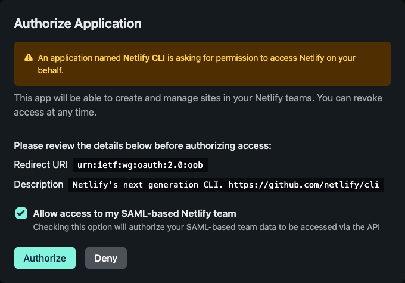

# Developer Experience

This is a repo for DX-related things. Right now we use it for a few small utilities.

Most of what this org does happens in
[our Notion docs](https://www.notion.so/netlify/About-DX-Netlify-876ff549e02646b7b4d889e025ec7768).

You can also find us [on Slack in #crew-all-dx](https://netlify.slack.com/archives/CCC1HDWQY).

> **NOTE:** a lot of the code in this repo is copy-pasta from https://github.com/learnwithjason/slack-bot, which is
> released under the ISC license.

## First time setup

Install dependencies in the project root:

```
npm i
```

Sign in to your _Netlify_ Netlify account. First, log in to that account in your browser, and run the following command
in your terminal.

```
netlify login
```

**Make sure you select the checkbox to "Allow access to my SAML-based Netlify team".**



To check you're signed in correctly, run the following command:

```
netlify status
```

You should see something like this. Make sure you see "Netlify" under the teams heading!

```
──────────────────────┐
 Current Netlify User │
──────────────────────┘
Name:  Your Name
Email: you@netlify.com
Teams:
  Your team: Collaborator
  Netlify: Owner Collaborator Controller
```

Run the following command in your terminal to link your local repo with the Netlify site:

```
netlify link
```

## Local development

Run the app in development using:

```
netlify dev
```

All environment variables needed will be injected for you.

To call a function, hit an endpoint in your browser, formatted like:

```
http://localhost:8888/api/slack/triage-reminder
```

Test the output of the Appybara in [#test-dx-appybara](https://app.slack.com/client/T02UKDKNA/C04C21ZNFEC) in the
Netlify Slack.
